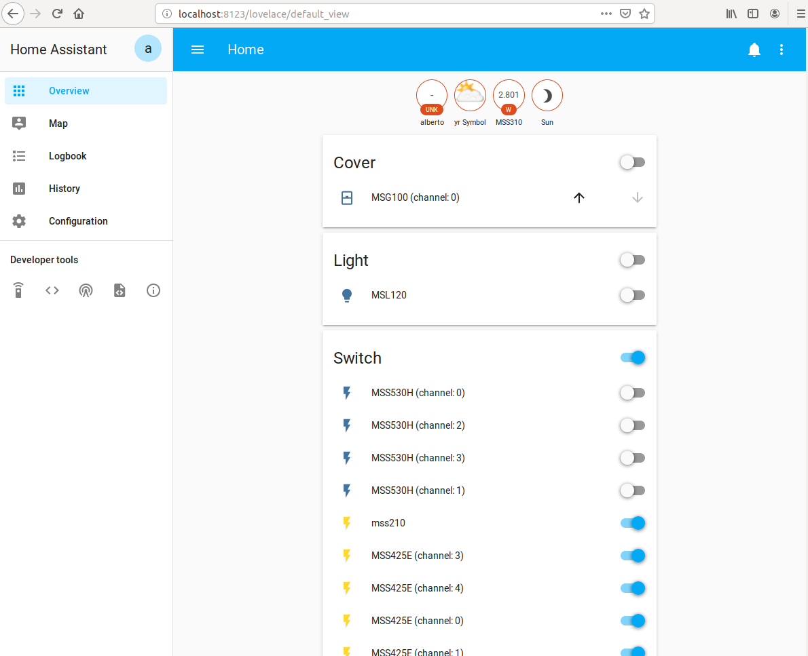
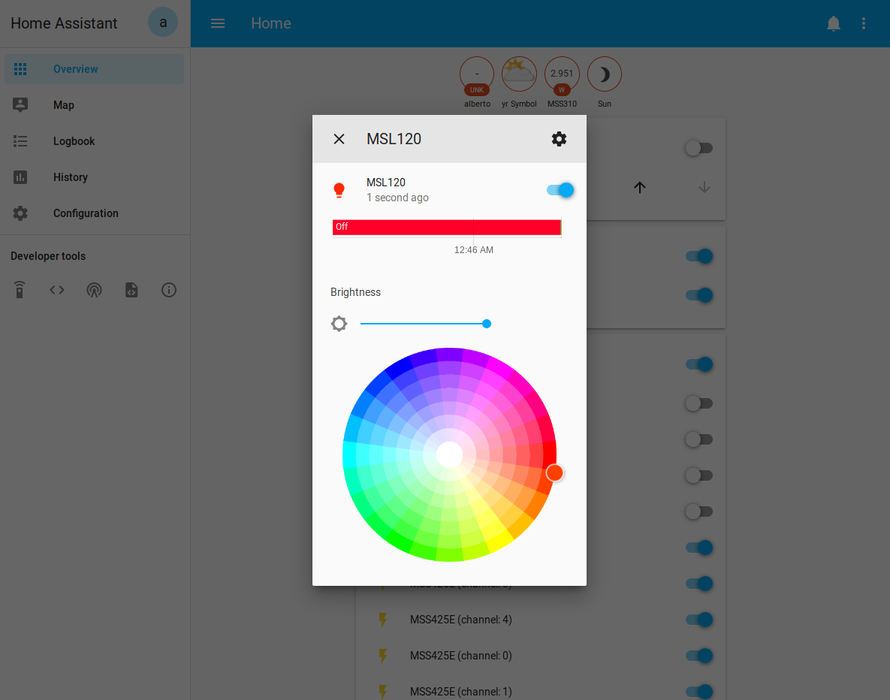
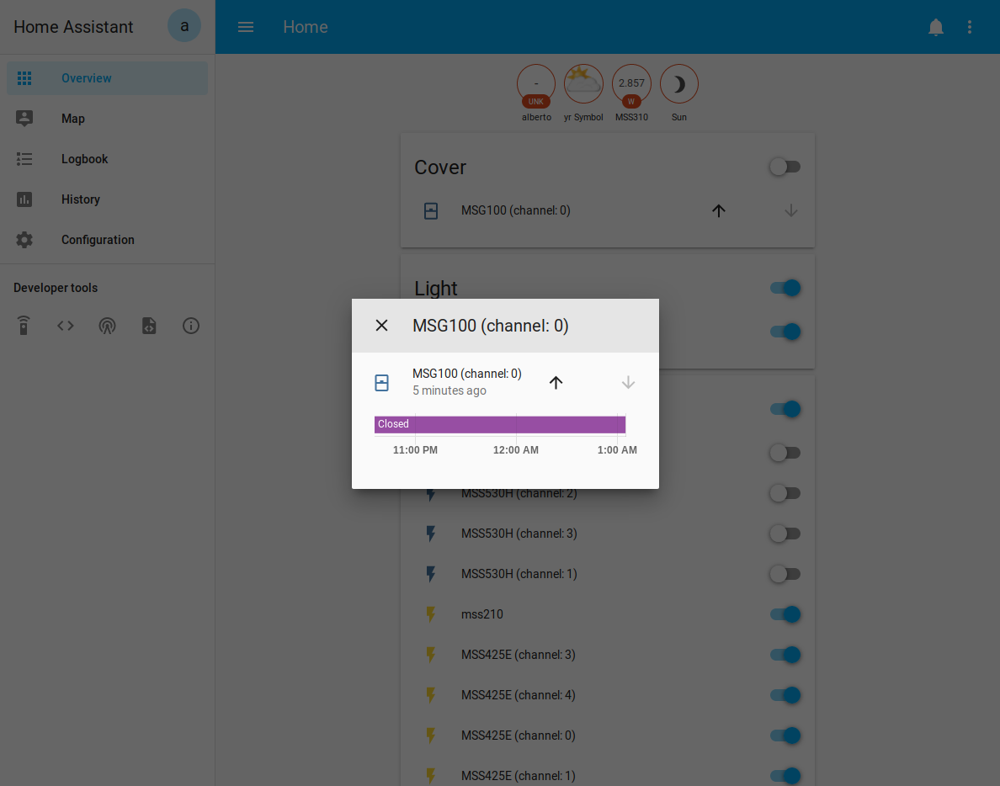
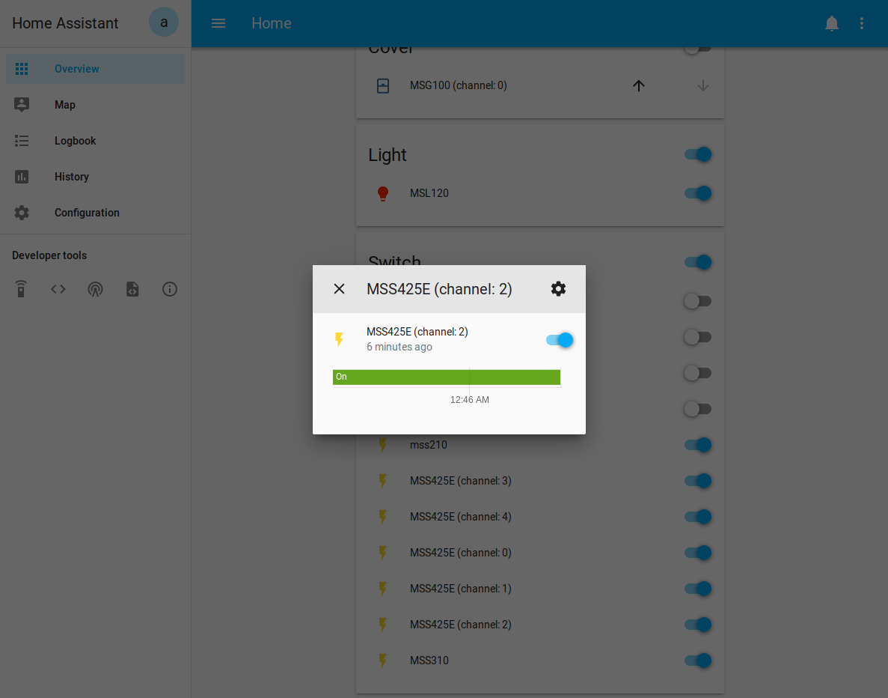

[](https://github.com/hacs/integration)


# Meross HomeAssistant component
A full-featured Homeassistant component to drive Meross devices. 
This component is based on the underlying MerossIot library available [here](https://github.com/albertogeniola/MerossIot).

## Installation & configuration
You can install this component in two ways: via HACS or manually.
HACS is a nice community-maintained components manager, which allows you to install git-hub hosted components in a few clicks.
If you have already HACS installed on your HomeAssistant, it's better to go with that.
On the other hand, if you don't have HACS installed or if you don't plan to install it, then you can use manual installation.

### Option A: Installing via HACS
If you have HACS, well, it's piece of cake! 
Just search for "Meross" (Full name is Meross Cloud IoT) in the default repository of HACS and it'll show up.
Click on Install. When the installation completes, **you must restart homeassistant** in order to make it work.
As soon as HomeAssistant is restarted, you can proceed with __component setup__.

### Option B: Classic installation (custom_component)
1. Download the latest zip release archive from [here](https://github.com/albertogeniola/meross-homeassistant/releases/latest)
1. Unzip/copy the meross_cloud directory within the `custom_components` directory of your homeassistant installation.
The `custom_components` directory resides within your homeassistant configuration directory.
Usually, the configuration directory is within your home (`~/.homeassistant/`).
In other words, the configuration directory of homeassistant is where the config.yaml file is located.
After a correct installation, your configuration directory should look like the following.
    ```
    └── ...
    └── configuration.yaml
    └── secrects.yaml
    └── custom_components
        └── meross_cloud
            └── __init__.py
            └── common.py
            └── cover.py
            └── ...
    ```

    **Note**: if the custom_components directory does not exist, you need to create it.

After copy-pasting the meross_cloud directory into the custom_components folder, you need to restart HomeAssistant.
As soon as HomeAssistant is restarted, you can proceed with __component setup__.

### Component setup    
Once the component has been installed, you need to configure it in order to make it work.
To do so, navigate to "Configuration -> Integrations -> Add Integration" and look for "Meross Cloud IoT".
As soon as you add it, you'll be asked to configure it. 
The following table summarizes the fields that the wizard will require you to fill in:

|  Field Name                      | Example Value           | Description                                             | 
|----------------------------------|-------------------------|---------------------------------------------------------|
| HTTP Api Endpoint                | https://iot.meross.com  | Is the HTTP(s) API endpoint used by the Meross Manager. This might vary in accordance with your country | 
| Email Address                    | johndoe@gmail.com       | Your Meross account username/email. If connecting to the official Meross cloud, use the same from the Meross App |
| Password                         | R4nd0mS3cret            | Your Meross account password. If connecting to the official Meross cloud, use the same from the Meross App |
| Skip MQTT certificate validation | True (Checked)          | Configures MQTT certificate validation. When unchecked it requires a valid certificate to be exposed from the Meross Server. If checked, it skips the MQTT certificate validation. If connecting to the official Meross cloud, you can uncheck this. When connecting to local-lan or custom MQTT brokers, you might want to check this. |

The following animation shows an example of component configuration
[](https://raw.githubusercontent.com/albertogeniola/meross-homeassistant/master/docs/source/images/components/meross_cloud/install-via-webui.gif)

## Features
### Massive support
This library supports all the Meross devices currently exposed by the Meross IoT library.
In particular Bulbs, Switches, Garage Door Openers and Smart Valves/Thermostat are fully supported and perfectly integrated with HomeAssistant.

<details>
    <summary>Have a look a the screenshots below...</summary>

 
 
 
 
 
</details>
 
## :new: :rocket: A first version of the Local-Only Addon is HERE! :rocket:
It took a bit, but eventually it's here. A very first **unstable** version of the Local Meross Addon has been developed.
The latest version of this component, v1.2.5rc1, does support it and has been tested successfully with both a MSS210 and a MSS310 devices.
Please note that the usage of the Local Addon is only advised for all the advanced users who are experiencing problems with Meross security
team, complaining about high rate API calls to their systems. If you plan to use such devices off-grid, the Local Addon is what you are
looking for. Again, be avised: it's still a work in progress and your devices might not work as expected (for now).

You can find installation instructions for the Local Addon directly [here](https://github.com/albertogeniola/ha-meross-local-broker).

### What is the local-addon?
Meross Plugin has gained great success and popularity among the HomeAssistant users. However, the Meross engineers are imposing
new limits on their MQTT broker system, which cause problems to the HA users who want to implement aggressive polling or have
more than 10 devices connected to HA. For this reason, I am working on a new HomeAssistant addon, namely "Meross Local Addon", 
which aims at re-implementing the Meross MQTT Broker and HTTP API layer locally to the addon. This would basically allow users
to rely only on LAN-local connection, using HomeAssistant as command center. 

### How to use the this Meross Component with the Local Addon?
In order to take advantage of the Local Meross Addon, you need to follow the instructions below:
1. Install or update the version of the Meross Custom Component via HACS (or manually, if you prefer) at least to version 1.2.5rc1, 
which is the first one supporting the Meross Local Addon.
1. Add the Meross Local Addon repository to your HomeAssistant installation. You can do that following the [instructions here]([url](https://github.com/albertogeniola/ha-meross-local-broker)) or simply press the following button

    [](https://my.home-assistant.io/redirect/supervisor_add_addon_repository/?repository_url=https%3A%2F%2Fgithub.com%2Falbertogeniola%2Fmeross-local-homeassistant)
1. Make sure the "Meross Local Addon for Homeassistant" appears in the section of "community addons" and, if so, install it. At the time of writing the latest
available version is *0.0.1-alpha42*. Depending on the HA hosting system and on the internect connection speed, it can take up to 20 minutes for the installation to complete.

    <a href="https://user-images.githubusercontent.com/4648843/174432626-51b6a569-2d95-464e-87bc-8a6fa702f9f1.png"></a>
    <a href="https://user-images.githubusercontent.com/4648843/174432630-031526ee-5f42-4d61-bfa2-e9badbc74675.png"></a>
1. Navigate to the configuration section of the "Meross Local Addon" and make sure the option reinit_db is OFF, while the option "advertise" is ON. Leave debug_mode OFF, unless you need to provide supplementary logging information to debug issues. Make sure you don't have any firewall blocking the network traffic to the ports indicated on this section, as the addon will receive traffic from both meross devices and pairer app on such ports.
    
    <a href="https://user-images.githubusercontent.com/4648843/174433609-0997e67d-adf5-4262-9c30-ea2eaae08169.png"></a>
1. Navigate to the "info" panel of the addon and make sure the "Start at boot" option is ON. Also, make sure the "Show in menu" option is set to ON. Then, start the ADDON and wait at least 5 minutes. Depending on the device you are running on, the first boot may take up to 10 minutes to complete.

    <a href="https://user-images.githubusercontent.com/4648843/174433626-f3cb7efb-b6aa-4930-9a13-ba7a95cae678.png"></a>
1. Open "Meross Local Addon" web-interface (you can either click on "Open Web UI" or click on the left menu icon . Then, from the web-ui, click on "Wizard Setup" or on "Setup"  and follow the instructions to configure your addon. For now, it's advised not to use the "Official Meross Link", as it is still under development.

    <a href="https://user-images.githubusercontent.com/4648843/174433687-deb0ee20-a4fc-4258-9553-cd5221a64b0e.png"></a>
    <a href="https://user-images.githubusercontent.com/4648843/174433758-69c4eb07-c00e-49f5-b041-60f36f5fef93.png"><a>

1. The wizard will guide you through the Account Setup, Meross App installation and pairing process. Make sure you are able to pair at least one device.
    Note about Step 1, credentials setup: choose the username/password you will be using locally to pair your devices. If you don't plan to "link" the local addon to the official meross broker, you can choose whatever credentials you like. For instance, you can set: 
        username: `meross@local`
        password: `changeme`
1. When you have paired all the devices you want to manage locally, you can proceed with the setup of the Meross Component. 
Navigate to the HA integration list, and proceed with the installation of the Meross Addon. During the setup phase, make sure to select local addon setup option, not the one relying on the official Meross Broker.
    
**NOTE**: sometimes, for yet-unknown reasons, MSS310 fails to pair with the local addon broker. However, resetting and retrying the pairing procedure a second time usually works. More recent devices, as the mss210, seem not to suffer of the same problem.

As you can imagine, there is a huge work behind that: first I need to reverse-engineer the Meross protocols, then I need to 
implement any "logic-layer" implemented on Meross Systems on the new addon I am developing and, eventually, I have to make
sure that everything works together. That means that I am not able to spend much time in solving issues that may arise in 
the meantime, and for that I apologize. If you like this project and you want to support me, please consider donating:
that motivates me and helps me buy _more ram_ which is absolutely necessary when developing on a virtualized environment.

## Supporting my work
By buying me a coffee, not only you make my development more efficient, but also motivate me to further improve 
my work. On the other hand, buying me a beer will certainly make me happier: **a toast to you, supporter**!
In case you are a pro and a strong opensource supporter, you might also consider [sponsoring my GitHub work](https://github.com/sponsors/albertogeniola).

[](https://www.buymeacoffee.com/albertogeniola)

