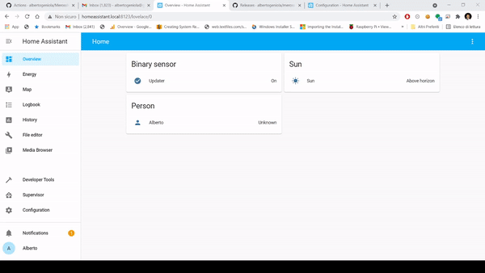

# Meross Custom Component
Based on pure-python library, this custom component enables full control on your meross devices. 

## Features
* Supports Meross power plugs, included power metering/electricity measure
* Supports light bulb switching and color setting
* Supports Garage Door openers
* Supports multi-channel power strips 
* Event driven: no bandwidth is wasted

## Requirements
Please note that the Meross devices are controlled via Meross Cloud. This means that homeassistant 
should have internet access to accomplish such task.

## Configuration
Once installed, the Meross Cloud component needs to be configured in order to work.
You can configure it either via the homeassistant Lovelace web interface or by editing the configuration.yaml file. 
We recommend using the Lovelace web ui as it's more user friendly.

### Option A: configuration via Lovelace web interface
Simply add a new "integration" and look for Meross among the proposed ones.
The following animation shows how to do that.

<a href="docs/source/images/components/meross_cloud/install-via-webui.gif">

</a>

### Option B: editing configuration.yaml
Edit `configuration.yaml` file and add the following:

```yaml
# Example configuration.yaml entry
meross_cloud:
  username: meross_username
  password: meross_password
```

Expert users might also decide to put secrets into the secrets.yaml file and use the !secret  directive 
within configuration.yaml.

## Be nice!
If you like the component, why don't you support me by buying me a beer or a coffe?
It would certainly motivate me to further improve this work.

[](https://www.buymeacoffee.com/albertogeniola)

[](https://beerpay.io/albertogeniola/meross-homeassistant)  [](https://beerpay.io/albertogeniola/meross-homeassistant?focus=wish)